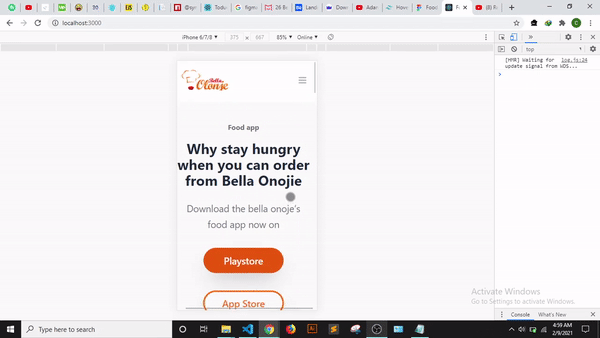

# React & Tailwind CSS Landing Page

## Intro

I started this project to gain experience of [Tailwind CSS](https://tailwindcss.com/) which is a utility-first mobile-first CSS library.

### Lighthouse Score

### Demo 

#### Desktop Demo

### Mobile Demo

## To Do
- [ ] Add [react-reveal](https://github.com/rnosov/react-reveal) animations
- [x] Complete hamburger menu
- [ ] Add Dark Mode
- [ ] Configure PWA

### Figma Design
[Figma Design](https://www.figma.com/file/DnGWAoCLprYt5yI3VJ0NTK/Food-delivery-app-Ui-kit-(Community)) for this project.

## Credits
Credits to [Marvis Dosa](https://dribbble.com/Marv_arts?ref=uistore.design) for the design.
